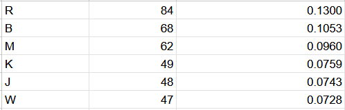

## 1. Background

We've been tasked with reversing a relatively short piece of text that was encrypted using a substitution cipher. We're going to try to break it via a letter frequency attack, let's see if we're successful!

## 2. Introduction

The first order of business is to tabulate and sort the letter frequencies of both the cipher text and the expected letter frequencies that occur in English texts.

At this stage, the need for a program wasn't quite clear yet, so these were sorted in Google Sheets for now.^[Check the appendix for full images, or better yet, the source files in the working directory if you have them.]

It may not seem like much, but this critical step allowed us to build some confidence on an otherwise daunting task. Could we really do this? We immediately opened up Visual Studio Code and tried a few substitutions with just `CTRL + F`, and replace all.

We see that both cipher text letter `r` and english letter `e` seem to have matching frequencies...let's try those first.

Nothing that we can really make out as English yet. Let's try a few more substitutions that seem to match up.

At this stage we start to run into a problem. It looks like we should we replace `k` with `o`, but cipher letter `j` occurs with a similar frequency, so it could easily be that `j` should be swapped with `o` instead. Let's try that substitution instead:

We're starting to see some words we can recognize! It seems this was the correct substitution instead.

