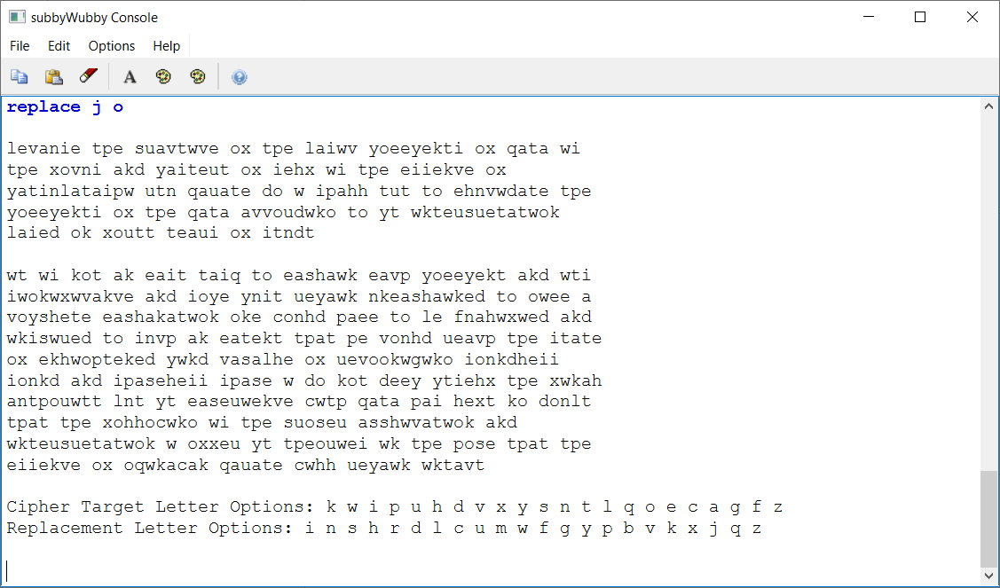
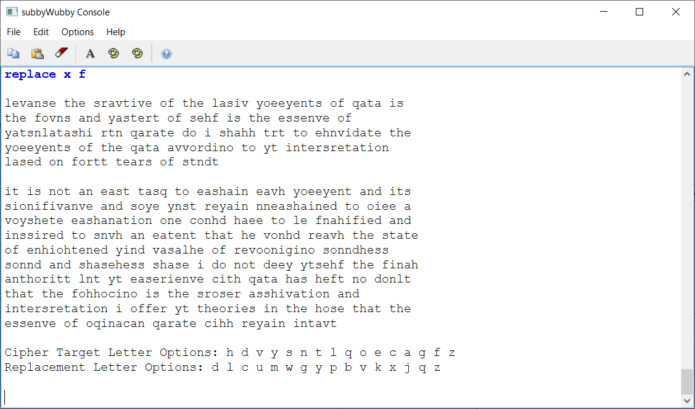

## 1. Background

We've been given a short piece of text that was encrypted using a substitution cipher. We're going to try to break by simply mapping the expected letter frequencies of English to the corresponding letter frequencies in the cipher text. Let's see if we're successful with this approach!

>lrvmnir bpr sumvbwvr jx bpr lmiwv yjeryrkbi jx qmbm wi
bpr xjvni mkd ymibrut jx irhx wi bpr riirkvr jx
ymbinlmtmipw utn qmumbr dj w ipmhh but bj rhnvwdmbr bpr
yjeryrkbi jx bpr qmbm mvvjudwko bj yt wkbrusurbmbwjk
lmird jk xjubt trmui jx ibndt

>wb wi kjb mk rmit bmiq bj rashmwk rmvp yjeryrkb mkd wbi
iwokwxwvmkvr mkd ijyr ynib urymwk nkrashmwkrd bj ower m
vjyshrbr rashmkmbwjk jkr cjnhd pmer bj lr fnmhwxwrd mkd
wkiswurd bj invp mk rabrkb bpmb pr vjnhd urmvp bpr ibmbr
jx rkhwopbrkrd ywkd vmsmlhr jx urvjokwgwko ijnkdhrii
ijnkd mkd ipmsrhrii ipmsr w dj kjb drry ytirhx bpr xwkmh
mnbpjuwbt lnb yt rasruwrkvr cwbp qmbm pmi hrxb kj djnlb
bpmb bpr xjhhjcwko wi bpr sujsru msshwvmbwjk mkd
wkbrusurbmbwjk w jxxru yt bprjuwri wk bpr pjsr bpmb bpr
riirkvr jx jqwkmcmk qmumbr cwhh urymwk wkbmvb

## 2. Introduction

We didn't immediately see the need to write a program just yet. We were anxious to see if our method had validity. So, we sorted the letter frequencies of both the cipher text and of English in Google Sheets. Then, we proceeded to map letters manually.^[We do eventually get around to writing a small program once the functionality we require becomes clear.] 


This innocent little step turned out to be critical later on, because it allowed us to build some understanding of what was needed for a decryption helper program. We started out just with Visual Studio Code and its ```CTRL+F``` find all and replace function. Just this simple approach allowed us to get surprisingly far, as we will see in Section 3.


## 3. Early Decryption Attempts

### 3.1 r --> e

We noticed that both cipher text letter `r` and English letter `e` seem to have matching frequencies, so let's try those first.

| Cipher Letter | English Letter |
| ------------- | -------------- |
| r             | e              |

: Replacements so far

>levmnie bpe sumvbwve jx bpe lmiwv yjeeyekbi jx qmbm wi
bpe xjvni mkd ymibeut jx iehx wi bpe eiiekve jx
ymbinlmtmipw utn qmumbe dj w ipmhh but bj ehnvwdmbe bpe
yjeeyekbi jx bpe qmbm mvvjudwko bj yt wkbeusuebmbwjk
lmied jk xjubt temui jx ibndt

>wb wi kjb mk emit bmiq bj eashmwk emvp yjeeyekb mkd wbi
iwokwxwvmkve mkd ijye ynib ueymwk nkeashmwked bj owee m
vjyshebe eashmkmbwjk jke cjnhd pmee bj le fnmhwxwed mkd
wkiswued bj invp mk eabekb bpmb pe vjnhd uemvp bpe ibmbe
jx ekhwopbeked ywkd vmsmlhe jx uevjokwgwko ijnkdheii
ijnkd mkd ipmseheii ipmse w dj kjb deey ytiehx bpe xwkmh
mnbpjuwbt lnb yt easeuwekve cwbp qmbm pmi hexb kj djnlb
bpmb bpe xjhhjcwko wi bpe sujseu msshwvmbwjk mkd
wkbeusuebmbwjk w jxxeu yt bpejuwei wk bpe pjse bpmb bpe
eiiekve jx jqwkmcmk qmumbe cwhh ueymwk wkbmvb

There's no real way to tell if this was a correct mapping or not. We do see the word 'but' appear, however it's too early for it to be a decrypted word. Let's try a few more.

### 3.2 b --> t

| Cipher Letter | English Letter |
| ------------- | -------------- |
| r             | e              |
| b             | t              |

: Replacements so far

>levmnie tpe sumvtwve jx tpe lmiwv yjeeyekti jx qmtm wi
tpe xjvni mkd ymiteut jx iehx wi tpe eiiekve jx
ymtinlmtmipw utn qmumte dj w ipmhh tut tj ehnvwdmte tpe
yjeeyekti jx tpe qmtm mvvjudwko tj yt wkteusuetmtwjk
lmied jk xjutt temui jx itndt

>wt wi kjt mk emit tmiq tj eashmwk emvp yjeeyekt mkd wti
iwokwxwvmkve mkd ijye ynit ueymwk nkeashmwked tj owee m
vjyshete eashmkmtwjk jke cjnhd pmee tj le fnmhwxwed mkd
wkiswued tj invp mk eatekt tpmt pe vjnhd uemvp tpe itmte
jx ekhwopteked ywkd vmsmlhe jx uevjokwgwko ijnkdheii
ijnkd mkd ipmseheii ipmse w dj kjt deey ytiehx tpe xwkmh
mntpjuwtt lnt yt easeuwekve cwtp qmtm pmi hext kj djnlt
tpmt tpe xjhhjcwko wi tpe sujseu msshwvmtwjk mkd
wkteusuetmtwjk w jxxeu yt tpejuwei wk tpe pjse tpmt tpe
eiiekve jx jqwkmcmk qmumte cwhh ueymwk wktmvt

### 3.3 m --> a

| Cipher Letter | English Letter |
| ------------- | -------------- |
| r             | e              |
| b             | t              |
| m             | a              |

: Replacements so far

>levanie tpe suavtwve jx tpe laiwv yjeeyekti jx qata wi
tpe xjvni akd yaiteut jx iehx wi tpe eiiekve jx
yatinlataipw utn qauate dj w ipahh tut tj ehnvwdate tpe
yjeeyekti jx tpe qata avvjudwko tj yt wkteusuetatwjk
laied jk xjutt teaui jx itndt

>wt wi kjt ak eait taiq tj eashawk eavp yjeeyekt akd wti
iwokwxwvakve akd ijye ynit ueyawk nkeashawked tj owee a
vjyshete eashakatwjk jke cjnhd paee tj le fnahwxwed akd
wkiswued tj invp ak eatekt tpat pe vjnhd ueavp tpe itate
jx ekhwopteked ywkd vasalhe jx uevjokwgwko ijnkdheii
ijnkd akd ipaseheii ipase w dj kjt deey ytiehx tpe xwkah
antpjuwtt lnt yt easeuwekve cwtp qata pai hext kj djnlt
tpat tpe xjhhjcwko wi tpe sujseu asshwvatwjk akd
wkteusuetatwjk w jxxeu yt tpejuwei wk tpe pjse tpat tpe
eiiekve jx jqwkacak qauate cwhh ueyawk wktavt

### 3.4 k --> o

Notice anything? I don't. Let's keep trying some more.

Well, we would, but there's a minor issue. The next few letters that might map onto 'o' are close to each other in frequency. How do we know which letter in the cipher text is the right one? We don't. We just have to try it and see what we get.

| Cipher Letter | English Letter |
| ------------- | -------------- |
| r             | e              |
| b             | t              |
| m             | a              |
| k             | o              |

: Replacements so far

>levanie tpe suavtwve jx tpe laiwv yjeeyeoti jx qata wi
tpe xjvni aod yaiteut jx iehx wi tpe eiieove jx
yatinlataipw utn qauate dj w ipahh tut tj ehnvwdate tpe
yjeeyeoti jx tpe qata avvjudwoo tj yt woteusuetatwjo
laied jo xjutt teaui jx itndt

>wt wi ojt ao eait taiq tj eashawo eavp yjeeyeot aod wti
iwoowxwvaove aod ijye ynit ueyawo noeashawoed tj owee a
vjyshete eashaoatwjo joe cjnhd paee tj le fnahwxwed aod
woiswued tj invp ao eateot tpat pe vjnhd ueavp tpe itate
jx eohwopteoed ywod vasalhe jx uevjoowgwoo ijnodheii
ijnod aod ipaseheii ipase w dj ojt deey ytiehx tpe xwoah
antpjuwtt lnt yt easeuweove cwtp qata pai hext oj djnlt
tpat tpe xjhhjcwoo wi tpe sujseu asshwvatwjo aod
woteusuetatwjo w jxxeu yt tpejuwei wo tpe pjse tpat tpe
eiieove jx jqwoacao qauate cwhh ueyawo wotavt

This seems to have gotten us less readable text. Could the correct mapping be 'j' to 'o' instead?

### 3.5 j --> o

| Cipher Letter | English Letter |
| ------------- | -------------- |
| r             | e              |
| b             | t              |
| m             | a              |
| j             | o              |

: Replacements so far

>levanie tpe suavtwve ox tpe laiwv yoeeyekti ox qata wi
tpe xovni akd yaiteut ox iehx wi tpe eiiekve ox
yatinlataipw utn qauate do w ipahh tut to ehnvwdate tpe
yoeeyekti ox tpe qata avvoudwko to yt wkteusuetatwok
laied ok xoutt teaui ox itndt

>wt wi kot ak eait taiq to eashawk eavp yoeeyekt akd wti
iwokwxwvakve akd ioye ynit ueyawk nkeashawked to owee a
voyshete eashakatwok oke conhd paee to le fnahwxwed akd
wkiswued to invp ak eatekt tpat pe vonhd ueavp tpe itate
ox ekhwopteked ywkd vasalhe ox uevookwgwko ionkdheii
ionkd akd ipaseheii ipase w do kot deey ytiehx tpe xwkah
antpouwtt lnt yt easeuwekve cwtp qata pai hext ko donlt
tpat tpe xohhocwko wi tpe suoseu asshwvatwok akd
wkteusuetatwok w oxxeu yt tpeouwei wk tpe pose tpat tpe
eiiekve ox oqwkacak qauate cwhh ueyawk wktavt

I see the word 'to' has popped up, and it's likely that it's a word we can trust, because we mapped 'b' to 't' earlier and that had a very strong frequency match. Since it looks like we're on the right path, let's keep trying.

### 3.6 k --> i

Since 'k' was undone in the last step, what it might be? Let's try to match it with next most frequent English letter in our chart, 'i'.

| Cipher Letter | English Letter |
| ------------- | -------------- |
| r             | e              |
| b             | t              |
| m             | a              |
| j             | o              |
| k             | i              |

: Replacements so far

>levanie tpe suavtwve ox tpe laiwv yoeeyeiti ox qata wi
tpe xovni aid yaiteut ox iehx wi tpe eiieive ox
yatinlataipw utn qauate do w ipahh tut to ehnvwdate tpe
yoeeyeiti ox tpe qata avvoudwio to yt witeusuetatwoi
laied oi xoutt teaui ox itndt

>wt wi iot ai eait taiq to eashawi eavp yoeeyeit aid wti
iwoiwxwvaive aid ioye ynit ueyawi nieashawied to owee a
voyshete eashaiatwoi oie conhd paee to le fnahwxwed aid
wiiswued to invp ai eateit tpat pe vonhd ueavp tpe itate
ox eihwopteied ywid vasalhe ox uevooiwgwio ionidheii
ionid aid ipaseheii ipase w do iot deey ytiehx tpe xwiah
antpouwtt lnt yt easeuweive cwtp qata pai hext io donlt
tpat tpe xohhocwio wi tpe suoseu asshwvatwoi aid
witeusuetatwoi w oxxeu yt tpeouwei wi tpe pose tpat tpe
eiieive ox oqwiacai qauate cwhh ueyawi witavt

That certainly doesn't seem like a good map. We got 'iot' as a decrypted word. We're confident that the 'o' and the 't' are correct mappings, so this just gave us a garbled English word. Let's try finding a different mapping for 'k'. The next closest English letter after 'i' would be 'n', so let's try that.

### 3.6 k --> n

| Cipher Letter | English Letter |
| ------------- | -------------- |
| r             | e              |
| b             | t              |
| m             | a              |
| j             | o              |
| k             | n              |

: Replacements so far

>levanie tpe suavtwve ox tpe laiwv yoeeyenti ox qata wi
tpe xovni and yaiteut ox iehx wi tpe eiienve ox
yatinlataipw utn qauate do w ipahh tut to ehnvwdate tpe
yoeeyenti ox tpe qata avvoudwno to yt wnteusuetatwon
laied on xoutt teaui ox itndt

>wt wi not an eait taiq to eashawn eavp yoeeyent and wti
iwonwxwvanve and ioye ynit ueyawn nneashawned to owee a
voyshete eashanatwon one conhd paee to le fnahwxwed and
wniswued to invp an eatent tpat pe vonhd ueavp tpe itate
ox enhwoptened ywnd vasalhe ox uevoonwgwno ionndheii
ionnd and ipaseheii ipase w do not deey ytiehx tpe xwnah
antpouwtt lnt yt easeuwenve cwtp qata pai hext no donlt
tpat tpe xohhocwno wi tpe suoseu asshwvatwon and
wnteusuetatwon w oxxeu yt tpeouwei wn tpe pose tpat tpe
eiienve ox oqwnacan qauate cwhh ueyawn wntavt

We just saw 'not' appear! This is much better.

### 3.7 Taking a look at our frequency tables again

It does seem like our frequency tables are becoming less reliable. We might have to start relying on just our intuition soon. That said, it's still too early to start guessing. Let's revist the tables again.


We see that the next most frequent cipher letter is 'w'. Perhaps that can be mapped onto the next most frequent English letter, 'i', which we erroneously thought 'k' was mapped to.

### 3.8 w --> i

| Cipher Letter | English Letter |
| ------------- | -------------- |
| r             | e              |
| b             | t              |
| m             | a              |
| j             | o              |
| k             | n              |
| w             | i              |

: Replacements so far

>levanie tpe suavtive ox tpe laiiv yoeeyenti ox qata ii
tpe xovni and yaiteut ox iehx ii tpe eiienve ox
yatinlataipi utn qauate do i ipahh tut to ehnvidate tpe
yoeeyenti ox tpe qata avvoudino to yt inteusuetation
laied on xoutt teaui ox itndt

>it ii not an eait taiq to eashain eavp yoeeyent and iti
iionixivanve and ioye ynit ueyain nneashained to oiee a
voyshete eashanation one conhd paee to le fnahixied and
inisiued to invp an eatent tpat pe vonhd ueavp tpe itate
ox enhioptened yind vasalhe ox uevoonigino ionndheii
ionnd and ipaseheii ipase i do not deey ytiehx tpe xinah
antpouitt lnt yt easeuienve citp qata pai hext no donlt
tpat tpe xohhocino ii tpe suoseu asshivation and
inteusuetation i oxxeu yt tpeouiei in tpe pose tpat tpe
eiienve ox oqinacan qauate cihh ueyain intavt

Did you see that? The word 'it' just appeared! This looks like a good map. Let's keep it. The next most frequent letter pairing is cipher letter 'i' mapped to 's', so let's give it a shot.

### 3.8 i --> s (Oops!)

| Cipher Letter | English Letter |
| ------------- | -------------- |
| r             | e              |
| b             | t              |
| m             | a              |
| j             | o              |
| k             | n              |
| w             | i              |
| i             | s              |

: Replacements so far

>levanse tpe suavtsve ox tpe lassv yoeeyents ox qata ss
tpe xovns and yasteut ox sehx ss tpe essenve ox
yatsnlatasps utn qauate do s spahh tut to ehnvsdate tpe
yoeeyents ox tpe qata avvoudsno to yt snteusuetatson
lased on xoutt teaus ox stndt

>st ss not an east tasq to eashasn eavp yoeeyent and sts
ssonsxsvanve and soye ynst ueyasn nneashasned to osee a
voyshete eashanatson one conhd paee to le fnahsxsed and
snsssued to snvp an eatent tpat pe vonhd ueavp tpe state
ox enhsoptened ysnd vasalhe ox uevoonsgsno sonndhess
sonnd and spasehess spase s do not deey ytsehx tpe xsnah
antpoustt lnt yt easeusenve cstp qata pas hext no donlt
tpat tpe xohhocsno ss tpe suoseu asshsvatson and
snteusuetatson s oxxeu yt tpeouses sn tpe pose tpat tpe
essenve ox oqsnacan qauate cshh ueyasn sntavt

Everything was going so well. What happened? Our attempts to map 'i' to 's' inadvertently undid our mapping of 'w' to 'i'. What do we do now?

How about an easy trick:

1. Undo w -> i
2. Map i -> s
3. Map w -> i

>levanse tpe suavtive ox tpe lasiv yoeeyents ox qata is
tpe xovns and yasteut ox sehx is tpe essenve ox
yatsnlataspi utn qauate do i spahh tut to ehnvidate tpe
yoeeyents ox tpe qata avvoudino to yt inteusuetation
lased on xoutt teaus ox stndt

>it is not an east tasq to eashain eavp yoeeyent and its
sionixivanve and soye ynst ueyain nneashained to oiee a
voyshete eashanation one conhd paee to le fnahixied and
inssiued to snvp an eatent tpat pe vonhd ueavp tpe state
ox enhioptened yind vasalhe ox uevoonigino sonndhess
sonnd and spasehess spase i do not deey ytsehx tpe xinah
antpouitt lnt yt easeuienve citp qata pas hext no donlt
tpat tpe xohhocino is tpe suoseu asshivation and
inteusuetation i oxxeu yt tpeouies in tpe pose tpat tpe
essenve ox oqinacan qauate cihh ueyain intavt

It worked! We're starting to see a lot of words now. So much that we could probably guess a few mappings. One such word is 'tpe', which is probably 'the', so we can guess that 'p' maps onto 'h'.

### 3.9 p --> h

| Cipher Letter | English Letter |
| ------------- | -------------- |
| r             | e              |
| b             | t              |
| m             | a              |
| j             | o              |
| k             | n              |
| i             | s              |
| w             | i              |
| p             | h              |

: Replacements so far

>levanse the suavtive ox the lasiv yoeeyents ox qata is
the xovns and yasteut ox sehx is the essenve ox
yatsnlatashi utn qauate do i shahh tut to ehnvidate the
yoeeyents ox the qata avvoudino to yt inteusuetation
lased on xoutt teaus ox stndt

>it is not an east tasq to eashain eavh yoeeyent and its
sionixivanve and soye ynst ueyain nneashained to oiee a
voyshete eashanation one conhd haee to le fnahixied and
inssiued to snvh an eatent that he vonhd ueavh the state
ox enhiohtened yind vasalhe ox uevoonigino sonndhess
sonnd and shasehess shase i do not deey ytsehx the xinah
anthouitt lnt yt easeuienve cith qata has hext no donlt
that the xohhocino is the suoseu asshivation and
inteusuetation i oxxeu yt theouies in the hose that the
essenve ox oqinacan qauate cihh ueyain intavt

This definitely seems right. What other mappings can we guess?

* How about 'theouies'? Perhaps we can map 'u' to 'r' to make 'theories'. It's worth a shot.
* The word 'ox' looks enticing. That's probably 'of'. Let's try mapping 'x' to 'f' as well.
* 'it is not an east tasq'? That's an interesting phrase. The map is probably 't' onto 'y', and 'q' onto 'k'.

Let's try these to see what we get.

### 3.10 Oops again! u --> r, x --> f, t --> y, q --> k

| Cipher Letter | English Letter |
| ------------- | -------------- |
| r             | e              |
| b             | t              |
| m             | a              |
| j             | o              |
| k             | n              |
| i             | s              |
| w             | i              |
| p             | h              |
| u             | r              |
| x             | f              |
| t             | y              |
| q             | k              |

: Replacements so far

Seems like it happened again. Our mapping of 't' to 'y' undid our mapping of 'b' to 't'. This approach is becoming untenable. It might be time to wrap it up.

>levanse yhe sravyive of yhe lasiv yoeeyenys of kaya is
yhe fovns and yasyery of sehf is yhe essenve of
yaysnlayashi ryn karaye do i shahh yry yo ehnvidaye yhe
yoeeyenys of yhe kaya avvordino yo yy inyersreyayion
lased on foryy years of syndy

>iy is noy an easy yask yo eashain eavh yoeeyeny and iys
sionifivanve and soye ynsy reyain nneashained yo oiee a
voysheye eashanayion one conhd haee yo le fnahified and
inssired yo snvh an eayeny yhay he vonhd reavh yhe syaye
of enhiohyened yind vasalhe of revoonigino sonndhess
sonnd and shasehess shase i do noy deey yysehf yhe finah
anyhoriyy lny yy easerienve ciyh kaya has hefy no donly
yhay yhe fohhocino is yhe sroser asshivayion and
inyersreyayion i offer yy yheories in yhe hose yhay yhe
essenve of okinacan karaye cihh reyain inyavy

### 3.11 Abandoning the manual approach

So, it looks like we've gotten as far as we could with just CTRL + F and replace. At this point, let's try to revert the 't' --> 'y' mapping and see if we scavenge a few more guesses for future reference.

>levanse the sravtive of the lasiv yoeeyents of kata is
the fovns and yastert of sehf is the essenve of
yatsnlatashi rtn karate do i shahh trt to ehnvidate the
yoeeyents of the kata avvordino to yt intersretation
lased on fortt tears of stndt

>it is not an east task to eashain eavh yoeeyent and its
sionifivanve and soye ynst reyain nneashained to oiee a
voyshete eashanation one conhd haee to le fnahified and
inssired to snvh an eatent that he vonhd reavh the state
of enhiohtened yind vasalhe of revoonigino sonndhess
sonnd and shasehess shase i do not deey ytsehf the finah
anthoritt lnt yt easerienve cith kata has heft no donlt
that the fohhocino is the sroser asshivation and
intersretation i offer yt theories in the hose that the
essenve of okinacan karate cihh reyain intavt

We can see a few likely candidates (it's okay if they're wrong at this stage).

* 'reyain' is probably 'remain', so maybe y --> m is a valid mapping. Noted.
* 'intavt' is probably 'intact', so let's note v --> c.
* 'sedx'? this passage looks like it's talking about spirituality, so I wouldn't be surprised if that were 'self'. Let's note d --> l.
* 'i shahh try to' looks like it's trying to say 'i shall try to'. let's note h --> l. (we're going to have to use our trick from Section 3.8 to apply it)

Let's try these mappings and see if they bear any fruit.

>lecanse the sractice of the lasic moeements of kata is
the focns anl mastert of sehf is the essence of
matsnlatashi rtn karate lo i shahh trt to ehncilate the
moeements of the kata accorlino to mt intersretation
lasel on fortt tears of stnlt

>it is not an east task to eashain each moeement anl its
sionificance anl some mnst remain nneashainel to oiee a
comshete eashanation one conhl haee to le fnahifiel anl
inssirel to snch an eatent that he conhl reach the state
of enhiohtenel minl casalhe of recoonigino sonnlhess
sonnl anl shasehess shase i lo not leem mtsehf the finah
anthoritt lnt mt easerience cith kata has heft no lonlt
that the fohhocino is the sroser asshication anl
intersretation i offer mt theories in the hose that the
essence of okinacan karate cihh remain intact

Mapping 'd' onto 'l' doesn't seem quite correct. It garbled words like 'and'. Let's try to discard that map while applying the others we noted.

>lecanse the sractice of the lasic moeements of kata is
the focns and mastert of self is the essence of
matsnlatashi rtn karate do i shall trt to elncidate the
moeements of the kata accordino to mt intersretation
lased on fortt tears of stndt

>it is not an east task to easlain each moeement and its
sionificance and some mnst remain nneaslained to oiee a
comslete easlanation one conld haee to le fnalified and
inssired to snch an eatent that he conld reach the state
of enliohtened mind casalle of recoonigino sonndless
sonnd and shaseless shase i do not deem mtself the final
anthoritt lnt mt easerience cith kata has left no donlt
that the follocino is the sroser asslication and
intersretation i offer mt theories in the hose that the
essence of okinacan karate cill remain intact

That looks a lot better! In fact it looks so readable that, we can still keep guessing some more mappings.

* 'c' probably maps onto 'w' because 'cill' and 'cith' looks like they're trying to be 'will' and 'with', respectively
* 's' probably maps onto 'p', because 'in the hose' is screaming out to me that it's actually 'in the hope'
* 'l' probably maps onto 'b', because 'lased' looks a lot like 'based'
* 'o' is probably maps onto 'g', because we see 'sionificance' and 'accordino' are trying to be 'significance and 'according'.

We've gotten surprisingly far with just the manual approach. This feels like a great stopping point to start writing our program. Now we understood what we needed--a way to keep track of what's already been decrypted so we don't mess with it again.

| Cipher Letter | English Letter |
| ------------- | -------------- |
| r             | e              |
| b             | t              |
| m             | a              |
| j             | o              |
| k             | n              |
| i             | s              |
| w             | i              |
| p             | h              |
| u             | r              |
| x             | f              |
| t             | y              |
| q             | k              |
| y             | m              |
| v             | c              |
| h             | l              |
| c             | w              |
| s             | p              |
| l             | b              |
| o             | g              |

: Likely mappings we've been able to glean so far

## 4. Time to Write Our Little Program

So, our main objective to achieve with our program is to be able to make note of letters which have already been decrypted. How can we do that? I thought of keeping track of the state of letters ```a~z``` in an array of integers, with a size of 26. If a letter had been swapped, I would just update its entry from ```0``` to ```1```. For example, if I wanted to update letter states of all 'i', I could just say:

```cpp
    int letterStates[26]{};
    char replacementLetter{'i'};
    letterStates[replacementLetter - 'a'] = 1;
```

As I was writing it though, I realized I didn't really care about the letters themselves. It was the *fields* I was interested in. For example, if I mapped 'w' onto 'i', then the above code would correctly reflect that the letters 'i' should not be swapped again. But what if I wanted to then map 'i' onto 's' in a subsequent step? I'm out of luck. What I wanted was just to leave swapped *fields* alone, not letters.

To accomplish this I opted for an object-oriented approach. I created a simple ```Ledder``` structure that would essentially hold characters, but on steroids. They could keep track of their states for me.

```cpp
class Ledder {

public:
    Ledder();
    Ledder(char ch);
    // omitted most of the class for clarity.
private:
    bool alreadySwapped_{}; // this little boolean is the magic
};
```
I then took the source cipher text, and created a new ```Ledder``` object for each and every letter. These ```Ledders``` were stored in a ```vector``` that my program would reference whenever it needed access to the cipher text. Anytime I needed to decrypt, instead of reading it directly from the file, I would read it from this ```vector```, where all the characters were juiced up.

```cpp
void loadCipherText(string &cipherTextFileName, vector<Ledder> &cipherText) {
    ifstream infile(cipherTextFileName);

    if (infile) {
        cout << "loading cipher text..." << '\n';

        char ch{};
        while (infile.get(ch)) {
            Ledder newLetter{ch};
            cipherText.push_back(newLetter);
        }

    }
```

Whenever I would perform a mapping, the code below would flip the ```Ledder``` state for me by calling ```mark()```. This simple approach worked out surprisingly well.

```cpp
bool replaceRoutine() {
    bool actuallyDidSomething{false};

    for (Ledder &currentLetter : cipherText) {

        if(currentLetter.getChar() == targetLetter && !currentLetter.swapped()) {
            actuallyDidSomething = true;
            currentLetter.setChar(replacementLetter);
            currentLetter.mark();
        }
    }

    return actuallyDidSomething;
}
```

I also implemented a few extra bells and whistles into the program, like saving a decryption map of steps we've taken so far, as well as an undo function. Those are auxiliary. Our ```replaceRoutine()``` is really the heart of the program, and it's what allowed us to decrypt with minimal fuss.

## 5. Back into the trenches. This time, with a friend.

Now that we have our friend, we can decrypt without having to worry about undoing a prior decryption step. Let's walkthrough the mappings we were able to figure out manually--only this time with our program instead of Visual Studio Code's ```CTRL+F```.

| Cipher Letter | English Letter |
| ------------- | -------------- |
| r             | e              |
| b             | t              |
| m             | a              |
| j             | o              |
| k             | n              |
| i             | s              |
| w             | i              |
| p             | h              |
| u             | r              |
| x             | f              |
| t             | y              |
| q             | k              |
| y             | m              |
| v             | c              |
| h             | l              |
| c             | w              |
| s             | p              |
| l             | b              |
| o             | g              |

: Mappings we figured out manually


 

 

 

 

 

 

 

 

 

 

 

 

 

 

 

 

 

 


That was quite a few mappings to go through. But it was worth it. Now we're really starting to be able to see big picture. Immediately we see a few likely mappings:

* 'n' probably maps onto 'u', from words like 'wonld', 'snch' 'bnt' 'sonnd', anthority', 'mnst' and probably a few others.
* 'a' might be 'x', from words like 'eaplanation', 'eaxtent', and 'eaperience'.
* 'e' maps onto 'v', from 'moeements'.


Looking good. We can see a few stray words that aren't quite right yet, though.

* 'f' should probably be 'q', because we see 'fualified'.
* 'g' is probably 'z', from the word 'recogniging'.


>because the practice of the basic movements of kata is
the focus and mastery of self is the essence of
matsubayashi ryu karate do i shall try to elucidate the
movements of the kata according to my interpretation
based on forty years of study

>it is not an easy task to explain each movement and its
significance and some must remain unexplained to give a
complete explanation one would have to be qualified and
inspired to such an extent that he could reach the state
of enlightened mind capable of recognizing soundless
sound and shapeless shape i do not deem myself the final
authority but my experience with kata has left no doubt
that the following is the proper application and
interpretation i offer my theories in the hope that the
essence of okinawan karate will remain intact

This reads like perfectly fine English. Have we done it? We never did figure out what 'd' maps onto. We know that 'z' doesn't occur at all in the text, so that doesn't have a mapping. Maybe 'd' just maps onto...'d'? That would make the most sense. It looks like we're done here, then! This seems like it's a preface to a Karate book. My deepest respect to the Sensei for sharing his wisdom with all of us.

## 6. Conclusion

It was incredibly statisfying to go from "can we really do this?" to a fully decrypted text. We started out just playing around with a few mappings manually. This grunt work actually paid off in the end though--it allowed us to build some confidence that this was actually possible, and more perhaps more importantly, it let us realize what we needed our program to help us with.

Once we had our program up and running, we were able to pick back up from where we left off. It was considerably easier this time around. The final solution basically fell into our laps. By the end, I felt as if though I've done something worthwhile. I was genuinely curious what the decrypted text was--no one goes out of their way to encrypt something unless they felt it had some deeper meaning.

Thank you.